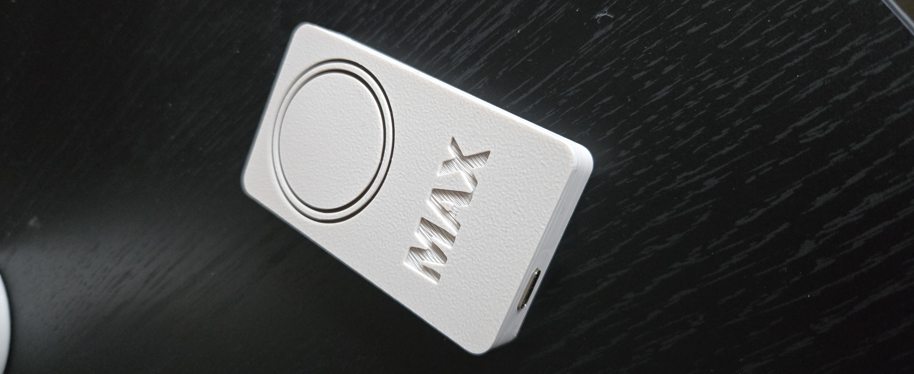
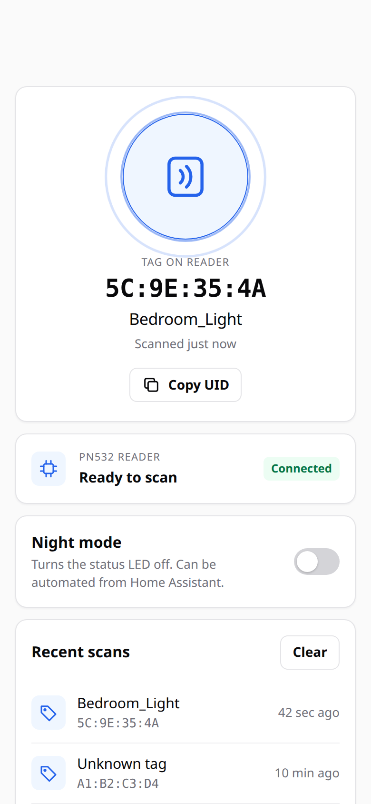
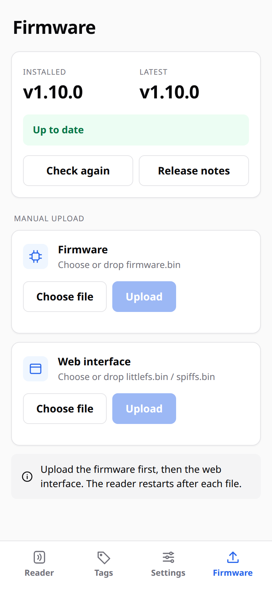

# NFC Reader for Home Assistant

ESP32-C3 SuperMini + PN532 NFC/RFID reader with MQTT integration for Home Assistant. Scan NFC tags to trigger automations.

<p align="center">
  
  
</p>


## Features

- **Home Assistant Integration** - MQTT auto-discovery, device triggers for automations
- **Tag Registry** - Name your tags for easy automations (e.g., "Bedroom_Light")
- **Auto-Update** - Checks GitHub for new releases, one-click install
- **Web Interface** - Configure WiFi, MQTT, register tags, update firmware
- **Night Mode** - Disable LED via MQTT/web (ideal for bedroom)
- **RGB LED Status** - Color-coded feedback for connection state
- **OTA Updates** - Wireless firmware updates via web interface or PlatformIO
- **Scan History** - View last 10 scanned tags

## Quick Start

### Option 1: Pre-built Binaries (Easiest)

1. Download the latest release from [Releases](https://github.com/martijnrenkema/NFC-reader/releases)
2. Flash using esptool (see Installation section)

### Option 2: Build from Source

```bash
# Clone repository
git clone https://github.com/martijnrenkema/NFC-reader.git
cd NFC-reader

# Build firmware
pio run -e esp32c3_supermini

# Build filesystem
pio run -e esp32c3_supermini -t buildfs
```

## Hardware

### Requirements

- ESP32-C3 SuperMini
- PN532 NFC/RFID breakout board (I2C mode)
- Dupont wires

### 3D Printed Case

A compact case is available on MakerWorld:

**[NFC Tag Reader Case on MakerWorld](https://makerworld.com/nl/models/1117728-nfc-tag-reader-esp8266-32-c6-c3-supermini-pn532)**

### Wiring

| ESP32-C3 | PN532 | Function |
|----------|-------|----------|
| 3.3V | VCC | Power |
| GND | GND | Ground |
| GPIO4 | SDA | I2C Data |
| GPIO5 | SCL | I2C Clock |
| GPIO3 | RSTO | Reset (optional) |

| ESP32-C3 | Function |
|----------|----------|
| GPIO8 | Built-in RGB LED (WS2812B) |

### PN532 DIP Switch (I2C mode)

```
SEL0: OFF
SEL1: ON
```

## Installation

### Step 1: Flash Firmware

#### Method A: Using PlatformIO (Recommended)

```bash
# Flash firmware
pio run -e esp32c3_supermini -t upload

# Flash filesystem (web interface)
pio run -e esp32c3_supermini -t uploadfs
```

#### Method B: Using esptool (Pre-built binaries)

> **You must flash TWO files: firmware + filesystem**
>
> | File | Address |
> |------|---------|
> | `firmware.bin` | `0x10000` |
> | `littlefs.bin` | `0x3D0000` |

```bash
# Flash both files
esptool.py --port /dev/cu.usbmodem* --chip esp32c3 --baud 921600 \
  write_flash 0x10000 firmware.bin 0x3D0000 littlefs.bin
```

### Step 2: Initial Setup

1. Power on the device - LED will pulse orange (AP mode)
2. Connect to WiFi network: `NFC-READER-XXXX` (password: `nfcreader`)
3. Open browser: `http://192.168.4.1`
4. Configure your WiFi credentials
5. Device restarts and connects to your network

### Step 3: Configure MQTT

1. Find device IP in your router or use the serial monitor
2. Open web interface
3. Enter MQTT broker settings
4. Device appears automatically in Home Assistant

## Updating Firmware

### Method 1: Automatic Update (v1.7.0+)

The device checks GitHub for updates automatically:
- 2 minutes after boot
- Every 24 hours

To install an update:
1. Open web interface → **Firmware Update**
2. Click **Check for Updates**
3. Click **Install Update** when available
4. Device downloads and installs automatically

<p align="center">
  
</p>

### Method 2: Manual Web Upload

1. Download firmware from [Releases](https://github.com/martijnrenkema/NFC-reader/releases)
2. Open web interface → **Firmware Update**
3. Upload `firmware.bin` and `littlefs.bin`

### Method 3: PlatformIO OTA

```bash
pio run -e esp32c3_ota -t upload
```

## Tag Registry

Register up to **50 NFC tags** with friendly names for easy Home Assistant automations.

### How It Works

1. **Scan a tag** on the reader
2. Open the **web interface** → **Tag Registry**
3. Click **"Use Last UID"** to auto-fill the UID
4. Enter a friendly name (e.g., `Bedroom_Light`, `Goodnight`, `Music_Toggle`)
5. Click **"Register Tag"**

### Naming Rules

- Names must be **1-31 characters**
- Use **letters, numbers, and underscores** only
- Names become Home Assistant **device trigger subtypes**
- Example: Tag named `Bedroom_Light` creates trigger `tag_scanned` / `Bedroom_Light`

### Benefits

| Feature | Without Registry | With Registry |
|---------|------------------|---------------|
| Home Assistant trigger | Generic `nfc` trigger | Named trigger (e.g., `Bedroom_Light`) |
| Automation setup | Need UID condition template | Direct trigger selection |
| Readability | UID like `C3:7B:70:19` | Friendly name |

## Home Assistant Integration

### MQTT Auto-Discovery

The device automatically appears in Home Assistant when MQTT is configured. No manual setup needed!

### Entities Created

| Entity | Type | Description |
|--------|------|-------------|
| Last Scanned UID | Sensor | Last scanned tag UID |
| Tag Present | Binary Sensor | Tag currently on reader |
| WiFi Signal | Sensor | Signal strength (dBm) |
| Night Mode | Switch | Disable LED |
| Update Available | Binary Sensor | New firmware available |
| Latest Version | Sensor | Latest available version |
| Current Version | Sensor | Installed firmware version |

### Device Triggers

| Trigger | Description |
|---------|-------------|
| `tag_scanned` / `nfc` | Fires on any tag scan (UID in payload) |
| `tag_scanned` / `<name>` | Fires when named tag is scanned |

### Automation Examples

#### Method 1: Named Tags (Recommended)

Register tags in the web interface for the easiest automations. The tag name becomes a selectable trigger in Home Assistant:

```yaml
automation:
  - alias: "Bedroom Light - NFC Tag"
    trigger:
      - platform: device
        domain: mqtt
        device_id: <your_device_id>
        type: tag_scanned
        subtype: Bedroom_Light  # Your registered tag name
    action:
      - service: light.toggle
        target:
          entity_id: light.bedroom
```

> **Tip:** In the Home Assistant UI, you can select the trigger directly from a dropdown - no need to type the UID!

#### Method 2: Generic Trigger with UID

For unregistered tags, use the generic `nfc` trigger with a template condition:

```yaml
automation:
  - alias: "NFC Tag Action"
    trigger:
      - platform: device
        domain: mqtt
        device_id: <your_device_id>
        type: tag_scanned
        subtype: nfc  # Generic trigger for any tag
    condition:
      - condition: template
        value_template: "{{ trigger.payload == 'C3:7B:70:19' }}"
    action:
      - service: light.toggle
        target:
          entity_id: light.kids_room
```

#### Multiple Tags in One Automation

Handle multiple unregistered tags with `choose`:

```yaml
automation:
  - alias: "NFC Multi-Tag Actions"
    trigger:
      - platform: device
        domain: mqtt
        device_id: <your_device_id>
        type: tag_scanned
        subtype: nfc
    action:
      - choose:
          - conditions: "{{ trigger.payload == 'C3:7B:70:19' }}"
            sequence:
              - service: light.turn_on
                target:
                  entity_id: light.bedroom
          - conditions: "{{ trigger.payload == '5C:9E:35:4A' }}"
            sequence:
              - service: scene.turn_on
                target:
                  entity_id: scene.movie_time
```

#### Night Mode Automation

```yaml
automation:
  - alias: "NFC Reader Night Mode"
    trigger:
      - platform: time
        at: "22:00:00"
    action:
      - service: switch.turn_on
        target:
          entity_id: switch.nfc_reader_night_mode
```

## MQTT Topics

| Topic | Description |
|-------|-------------|
| `nfc_reader_xxxx/tag/scanned` | Tag scan event (UID as payload) |
| `nfc_reader_xxxx/last_uid` | Last scanned UID (retained) |
| `nfc_reader_xxxx/tag_present` | ON/OFF |
| `nfc_reader_xxxx/availability` | online/offline |
| `nfc_reader_xxxx/night_mode` | Night mode status |
| `nfc_reader_xxxx/night_mode/set` | Night mode command |
| `nfc_reader_xxxx/update_available` | Update available (ON/OFF) |
| `nfc_reader_xxxx/latest_version` | Latest version available |
| `nfc_reader_xxxx/current_version` | Currently installed version |

## LED Status Indicators

| Color | Pattern | Status |
|-------|---------|--------|
| Light Blue | Fast blink | Connecting to WiFi |
| Orange | Slow pulse | AP mode (configuration) |
| Green | Soft pulse | Connected and idle |
| Cyan | Double flash | Tag scanned |
| Red | Fast blink | Error |
| Off | - | Night mode enabled |

## Configuration

### Default Passwords

| Function | Default | Changeable |
|----------|---------|------------|
| WiFi AP | `nfcreader` | Yes |
| OTA Updates | `nfc-ota` | Yes |

Change passwords in web interface under **Security**. Minimum 8 characters.

## Troubleshooting

### Device won't connect to WiFi
1. Long press reset button or power cycle
2. Connect to `NFC-READER-XXXX` AP
3. Reconfigure WiFi settings at `192.168.4.1`

### NFC reader not detected
1. Check wiring (I2C: GPIO4=SDA, GPIO5=SCL)
2. Verify PN532 DIP switches (SEL0=OFF, SEL1=ON)
3. Check serial monitor for error messages

### Auto-update shows "No releases found"
- Repository must be public for auto-update to work
- Check your internet connection

### Web interface not loading
- Flash the filesystem: `pio run -t uploadfs`
- Or download `littlefs.bin` from releases and flash to `0x3D0000`

## Building from Source

### Prerequisites
- [PlatformIO](https://platformio.org/) (VS Code extension or CLI)
- USB-C cable

### Build Commands

```bash
# Build firmware
pio run -e esp32c3_supermini

# Build filesystem
pio run -e esp32c3_supermini -t buildfs

# Upload firmware
pio run -e esp32c3_supermini -t upload

# Upload filesystem
pio run -e esp32c3_supermini -t uploadfs
```

## Project Structure

```
├── src/
│   ├── main.cpp              # Main entry point
│   ├── config.h              # Pin definitions & settings
│   ├── nfc_handler.*         # PN532 NFC reading
│   ├── led_controller.*      # RGB LED control
│   ├── storage.*             # Settings persistence (NVS)
│   ├── wifi_manager.*        # WiFi connection & AP mode
│   ├── web_server.*          # Web interface + OTA
│   ├── mqtt_handler.*        # MQTT + HA discovery
│   ├── update_checker.*      # GitHub auto-update
│   └── ota_handler.*         # ArduinoOTA
├── data/                     # Web files (LittleFS)
│   ├── index.html
│   ├── update.html
│   ├── style.css
│   └── script.js
├── platformio.ini
└── README.md
```

## Dependencies

- [PubSubClient](https://github.com/knolleary/pubsubclient) - MQTT client
- [ArduinoJson](https://github.com/bblanchon/ArduinoJson) - JSON parsing
- [ESPAsyncWebServer](https://github.com/me-no-dev/ESPAsyncWebServer) - Async web server
- [PN532](https://github.com/Seeed-Studio/PN532) - NFC reader library

## License

MIT License - feel free to use and modify.

## Changelog

### v1.8.0
**Bug Fixes, WiFi Improvements & LittleFS:**
- **LittleFS migration**: Switched from deprecated SPIFFS to LittleFS for better reliability and wear leveling
- **WiFi boost**: Maximum TX power (19.5dBm) and disabled power saving for better range
- **Bug fixes**: LED night mode recovery, UID bounds check, NFC null pointer guard, factory reset now clears tag registry, MQTT heap fragmentation reduction, OTA stability improvements

### v1.7.0
**Automatic Update Checker:**
- **Auto-update from GitHub**: Device checks for updates automatically (2 min after boot, then every 24 hours)
- **One-click install**: Download and install firmware + filesystem directly from GitHub releases
- **MQTT sensors**: New `update_available`, `latest_version`, `current_version` sensors
- **Web UI**: New "Automatic Update" section on firmware update page

### v1.6.0
**Stability & Performance:**
- Major stability improvements for 24/7 operation
- Non-blocking LED animations
- Improved MQTT reconnection handling

### v1.5.0
**Tag Registry:**
- Name your tags for easy Home Assistant automations
- Web interface for tag management

For older versions, see [GitHub Releases](https://github.com/martijnrenkema/NFC-reader/releases).
